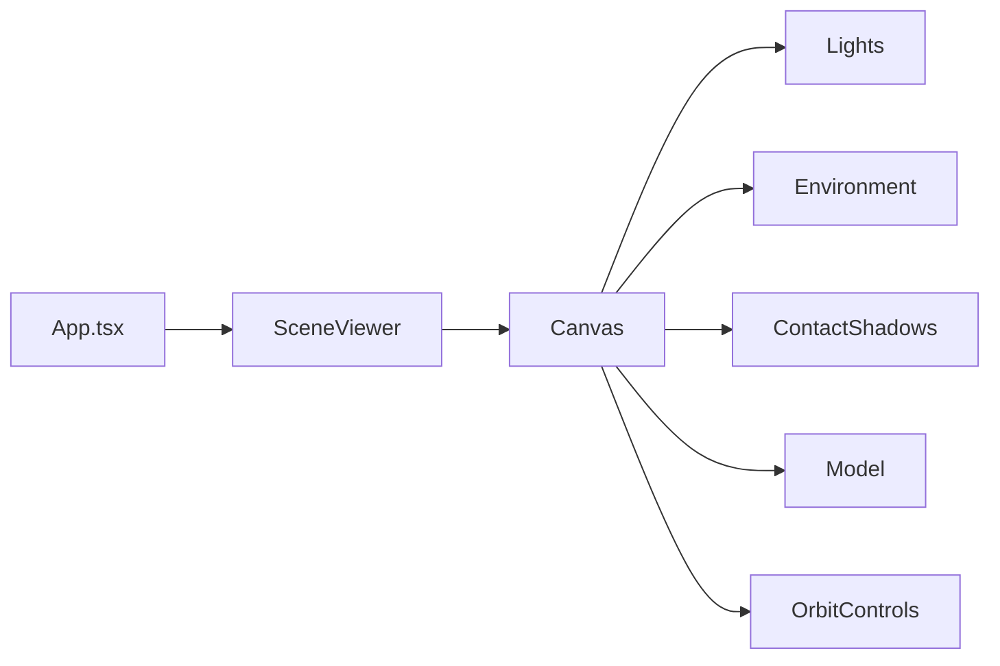

# 3D 场景代码结构与相机/光线自定义指南

## 技术栈与数据流

场景由 **[src/app/components/3D/screenViewer.jsx](src/app/components/3D/screenViewer.jsx)** 搭建，依赖：

- **React Three Fiber (R3F)**：在 React 里声明式写 Three.js 场景（`Canvas`、`useFrame` 等）
- **@react-three/drei**：R3F 的辅助库，提供 `useGLTF`、`OrbitControls`、`Environment`、`ContactShadows` 等
- **three**：底层 3D 引擎




---

## 场景是怎么「搭」出来的

1. **最外层**：`<Canvas>` 包住整个 3D 世界，并在这里设定**相机**和 WebGL 选项。
2. **相机**：通过 `camera` 属性设定初始位置和 FOV；用户拖拽、缩放由 `OrbitControls` 控制相机。
3. **光线**：在 `Canvas` 内先写 `ambientLight`、`directionalLight`、`pointLight`，再写 `Environment`（环境贴图）和 `ContactShadows`（接触阴影）。
4. **模型**：`Model` 用 `useGLTF(modelPath)` 加载 GLB，在 `useFrame` 里做漂浮、自转等动画。
5. **交互**：`OrbitControls` 绑定到相机，实现旋转、缩放（平移当前关闭）。

---

## 相机设定：在哪里改、改什么

**位置**：同一文件内，`<Canvas>` 的 `camera` 和 `<OrbitControls>`。


| 目的       | 位置（行号约）                | 当前值                                  | 说明                  |
| -------- | ---------------------- | ------------------------------------ | ------------------- |
| 初始相机位置   | `Canvas` 的 `camera` 属性 | `position: [0, 0, 5]`                | `[x, y, z]`，单位与场景一致 |
| 视野角度 FOV | 同上                     | `fov: 45`                            | 单位：度，越大视野越广         |
| 近裁剪面     | 未写                     | 默认                                   | 可加 `near: 0.1` 等    |
| 远裁剪面     | 未写                     | 默认                                   | 可加 `far: 1000` 等    |
| 缩放限制     | `OrbitControls`        | `minDistance={2}` `maxDistance={10}` | 滚轮缩放时相机与目标最近/最远距离   |
| 是否允许平移   | `OrbitControls`        | `enablePan={false}`                  | 改为 `true` 可开启平移     |


**示例**：把相机拉远、视野变广，并允许平移：

```jsx
<Canvas
  camera={{
    position: [0, 0, 8],  // 更远
    fov: 50,              // 更广
    near: 0.1,
    far: 1000,
  }}
  gl={{ antialias: true, alpha: true }}
  ...
>
  ...
  <OrbitControls
    minDistance={2}
    maxDistance={15}
    enablePan={true}
    ...
  />
</Canvas>
```

如需在运行时用代码改相机（例如切机位），可在组件内用 `useThree()` 拿到 `camera`，再改 `camera.position`、`camera.fov` 等。

---

## 场景光线：在哪里改、改什么

**位置**：同一文件内，`Canvas` 子节点中的「Lighting」注释块（约 104–121 行）。

当前光线组成：


| 类型                      | 当前作用         | 可调参数                                              |
| ----------------------- | ------------ | ------------------------------------------------- |
| `ambientLight`          | 整体基础亮度，无方向   | `intensity`（当前 0.3）                               |
| `directionalLight` (主)  | 主光源，右前上方，带阴影 | `position`、`intensity`（1.2）、`castShadow`、`color`  |
| `directionalLight` (辅)  | 左侧补光，偏冷色     | `position`、`intensity`（0.4）、`color`（#c8d8f0）      |
| `pointLight`            | 下方一点光，暖色     | `position`、`intensity`（0.3）、`color`（#f0ece8）      |
| `Environment` (drei)    | 环境贴图，金属/反光   | `preset`（当前 `"studio"`）或 `files` 自定义 HDR          |
| `ContactShadows` (drei) | 模型与地面接触阴影    | `position`、`opacity`、`scale`、`blur`、`far`、`color` |


**自定义示例**：

- 整体更亮/更暗：调大/调小 `ambientLight` 的 `intensity`。
- 主光方向：改第一个 `directionalLight` 的 `position={[x, y, z]}`（例如 `[8, 10, 6]` 更偏右前上）。
- 主光颜色/强度：改该灯的 `color`、`intensity`。
- 换环境感：把 `<Environment preset="studio" />` 改成 `preset="sunset"`、`"night"` 等，或用 `files="你的.hdr路径"`。
- 接触阴影更明显：增大 `ContactShadows` 的 `opacity`、`blur` 或 `scale`。

模型材质侧的「环境反射强度」在 `Model` 的 `useEffect` 里：`child.material.envMapIntensity = 1.8`，改这个值可加强/减弱环境对金属感的影响。

---

## 小结

- **场景搭建**：在 [screenViewer.jsx](src/app/components/3D/screenViewer.jsx) 里用 `<Canvas>` + 灯光 + `Environment` + `ContactShadows` + `Model` + `OrbitControls` 搭出整块 3D 场景。
- **自定义相机**：改 `<Canvas camera={...}>` 的 `position`、`fov`、`near`、`far`；改 `<OrbitControls>` 的 `minDistance`、`maxDistance`、`enablePan`；需要动态控制时用 `useThree()` 拿 `camera`。
- **自定义光线**：在同一文件「Lighting」区块改各 `ambientLight`/`directionalLight`/`pointLight` 的 `position`、`intensity`、`color`；换氛围改 `Environment` 的 `preset` 或 `files`；接触阴影改 `ContactShadows` 的 `opacity`、`scale`、`blur` 等；金属反光强度改 `Model` 里的 `envMapIntensity`。

按上述位置在 `screenViewer.jsx` 中修改即可完成相机与场景光线的自定义，无需改其它文件。